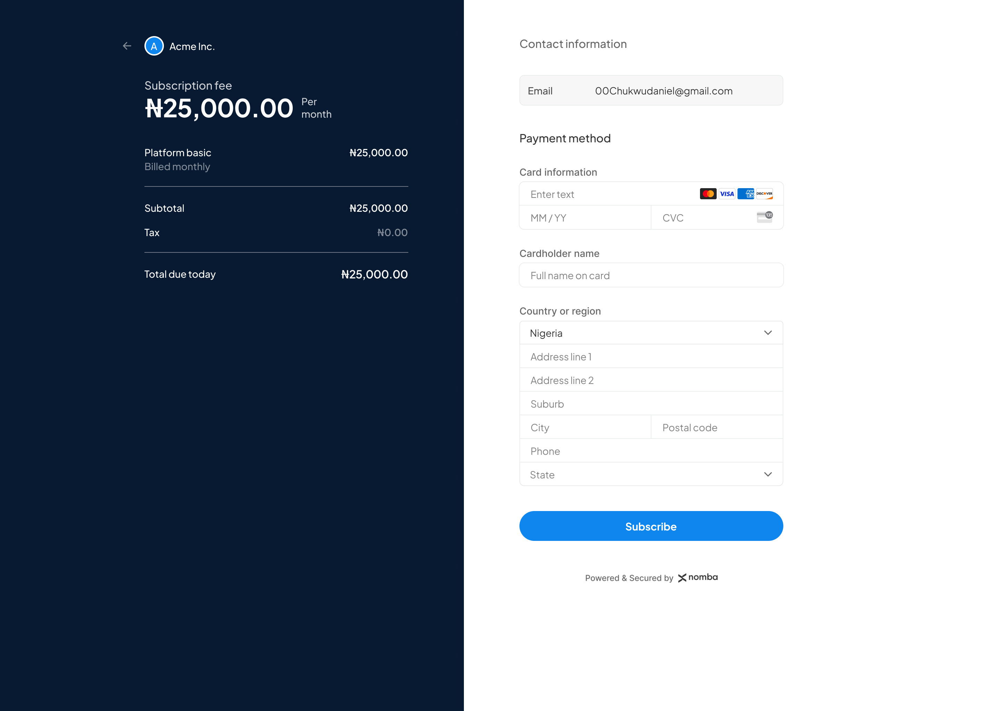
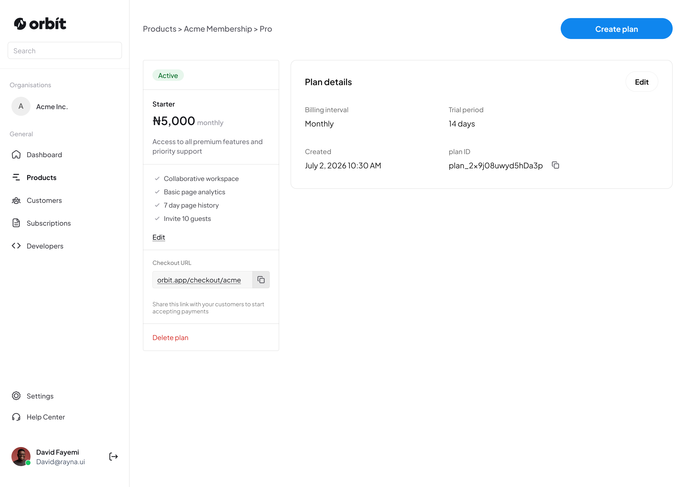
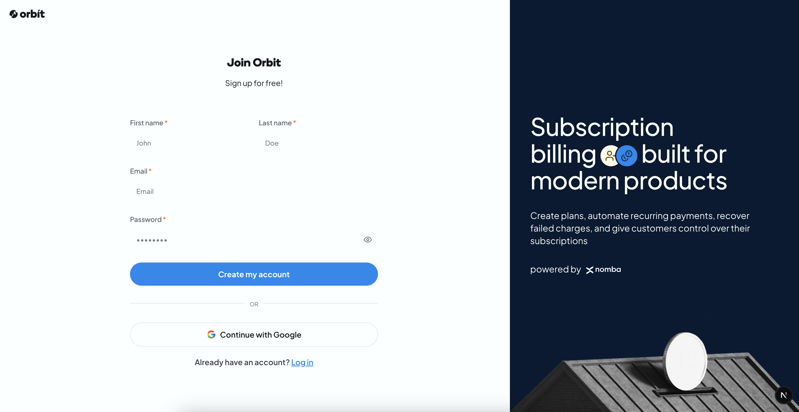
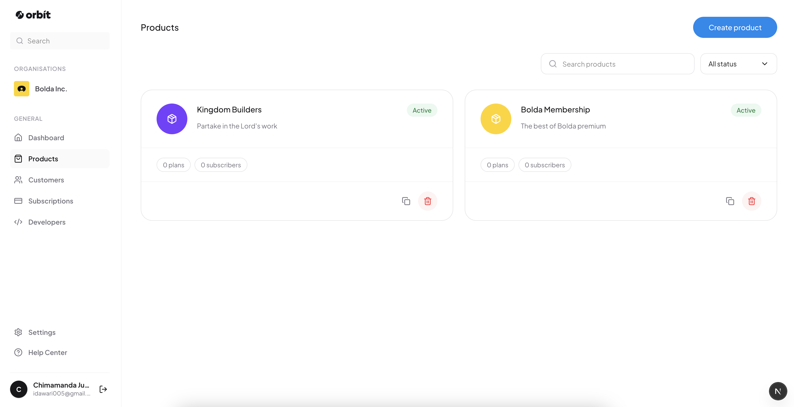

# Orbit

Orbit is a multi-tenant subscription infrastructure platform that lets businesses create products, manage plans, and accept recurring payments through a hosted checkout system powered by Nomba.

[FIGMA DESIGN]('https://www.figma.com/design/Z61MYyuK3CMmnAbl1X22L0/Orbit-Billing?node-id=0-1&t=sdRFsOzOFu7Dq7vb-1')

