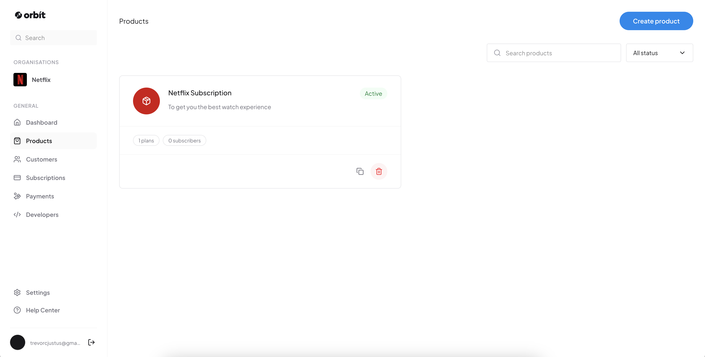

# Orbit

Orbit is a multi-tenant subscription infrastructure platform that helps businesses create products, configure pricing plans, collect recurring payments, and manage customer subscriptions through a hosted checkout and billing system powered by Nomba.

The goal of Orbit is to provide businesses with the infrastructure needed to launch subscription-based products without building their own billing engine, payment workflows, renewal systems, or customer management dashboards.

## Links

### Live Application

[https://orbit-billing-nomba.vercel.app/](https://orbit-billing-nomba.vercel.app/)

### Figma Design

[Orbit Billing Design](https://www.figma.com/design/Z61MYyuK3CMmnAbl1X22L0/Orbit-Billing?node-id=0-1&t=WCjD06PrFjmRdRWA-1)




## Product Overview

Modern businesses rely on recurring revenue models, but building subscription infrastructure requires handling:

- Customer management
- Product and pricing configuration
- Payment processing
- Recurring billing
- Payment retries
- Subscription lifecycle management
- Webhooks
- Customer self-service
- Merchant analytics

Orbit solves this by providing a complete subscription management layer.

Businesses can create products, attach pricing plans, generate checkout links, collect payments, and automatically manage recurring subscriptions.

## Core Features

### 1. Multi-Tenant Merchant Dashboard

Orbit supports multiple businesses using the same platform while keeping each organisation's data isolated.

Each organisation has access to:

- Products
- Plans
- Customers
- Payments
- Subscriptions
- Analytics

Every query is scoped by:

```
organisation_id
```

This ensures merchants can only access their own billing data.

### 2. Product Management

Businesses can create and manage products.

Each product contains:

- Product name
- Description
- Brand colour
- Checkout slug
- Active/inactive status

**Example:**

```
Product
├── SaaS Starter
├── Fitness Membership
└── Premium Community Access
```

Merchants can:

- Create products
- View products
- Copy checkout links
- Delete products
- Manage pricing plans attached to products

### 3. Pricing Plans

Each product can have multiple pricing plans.

Supported billing intervals:

- Monthly
- Yearly
- Custom intervals
- Demo/test intervals

**Example:**

```
Product: Fitness Membership
Plans:
  Starter     — ₦5,000/month
  Premium     — ₦15,000/month
  Enterprise  — ₦150,000/year
```

Plans determine:

- Amount
- Billing frequency
- Renewal schedule
- Subscription behaviour

### 4. Hosted Checkout System

Orbit provides a hosted checkout page where customers can subscribe.

**Checkout flow:**

```
Customer opens checkout link
        ↓
Customer enters details
        ↓
Payment processed through Nomba
        ↓
Transaction verified
        ↓
Subscription created
        ↓
Card token stored
        ↓
Future renewals handled automatically
```

### 5. Nomba Payment Integration

Orbit integrates with Nomba for payment processing.

**Implemented:**

- OAuth authentication
- Checkout order creation
- Transaction verification
- Tokenized card payments
- Payment tracking

**Nomba APIs used:**

```
POST /v1/auth/token/issue
POST /v1/checkout/order
GET  /v1/transactions/accounts/single
POST /v1/checkout/tokenized-card-payment
GET /v1/transfers/banks
GET /v1/transactions/accounts/single
```

### 6. Recurring Subscription Engine

Orbit includes an automated subscription renewal system.

When a subscription reaches its renewal date:

```
Cron Job
   ↓
Find subscriptions where:
   renews_at <= current_time
   ↓
Charge saved card token
   ↓
Create payment record
   ↓
Update subscription
   ↓
Generate next renewal date
```

### 7. Subscription State Management

Subscriptions move through different states:

```
ACTIVE
PAST_DUE
CANCELED
TRIALING
```

**Example lifecycle:**

```
Customer subscribes
        ↓
     ACTIVE
        ↓
Renewal date reached
        ↓
   Payment succeeds ──► Renewal date extended
   Payment fails    ──► PAST_DUE ──► Retry payment
```

### 8. Automated Renewal Cron

Orbit uses a scheduled cron process to handle recurring payments.

**Cron location:**

```
/app/api/cron/renew-subscriptions/route.ts
```

**Purpose:**

- Check upcoming renewals
- Charge saved cards
- Update subscription status
- Record payment history

The cron runs automatically based on the configured schedule.

**Example:**

```json
{
  "schedule": "* * * * *"
}
```

### 9. Webhook Processing

Orbit receives payment events through Nomba webhooks.

**Webhook endpoint:**

```
/api/webhooks/nomba
```

**Responsibilities:**

- Receive payment events
- Validate webhook signatures
- Update payment status
- Activate subscriptions
- Handle failed payments

**Webhook security:**

Nomba signs webhook payloads using:

```
HMAC-SHA256
```

The signature is verified before processing events.

**Flow:**

```
Nomba
  ↓
Webhook Request
  ↓
Signature Verification
  ↓
Payment Update
  ↓
Subscription Update
```

### 10. Customer Management

Merchants can view all customers who have interacted with their products.

**Customer information:**

- Name
- Email
- Subscription status
- Total spending
- Join date

**Example:**

```
John Doe
john@example.com
Active subscription
₦50,000 spent
```

### 11. Payments Dashboard

Orbit provides payment tracking.

Merchants can view:

- Payment amount
- Customer
- Payment provider
- Payment status
- Transaction reference
- Payment date

**Supported statuses:**

- `SUCCESS`
- `FAILED`
- `PENDING`
- `REVERSED`

### 12. Merchant Analytics Dashboard

The dashboard provides real-time subscription insights.

**Metrics:**

- **Gross Revenue** — Total successful payments collected.
- **Monthly Recurring Revenue (MRR)** — Normalized recurring subscription revenue.

**Calculation:**

```
Monthly Plan:
  MRR = plan amount

Yearly Plan:
  MRR = yearly amount / 12
```

- **Active Subscribers** — Number of currently active subscriptions.
- **Top Products** — Ranks products based on generated revenue.

### 13. Customer Self-Service Portal

Orbit includes a customer portal where customers can manage their subscriptions.

https://orbit-billing-nomba.vercel.app/portal/{token}

Customers can:

- View subscription details
- View billing information
- Access payment history
- Manage their subscription lifecycle

**Portal flow:**

```
Customer
   ↓
Portal Link
   ↓
Authentication
   ↓
Subscription Dashboard
   ↓
Manage Billing
```

## Database Architecture

Orbit uses Supabase PostgreSQL.

**Main tables:**

- `users`
- `organisations`
- `products`
- `plans`
- `customers`
- `subscriptions`
- `payments`

**Relationship:**

```
Organisation
    └── Products
            └── Plans

Customers
    └── Subscriptions
            └── Payments
```

## Tech Stack

**Frontend**

- Next.js App Router
- React
- Tailwind CSS
- Lucide Icons

**Backend**

- Next.js Server Actions
- Next.js Route Handlers

**Database**

- Supabase PostgreSQL

**Authentication**

- Supabase Auth

**Payments**

- Nomba Payment API

**Deployment**

- Vercel / Cloud hosting

## Project Structure

```
src
├── app
│   ├── dashboard
│   │   ├── products
│   │   ├── subscriptions
│   │   ├── customers
│   │   ├── payments
│   │   └── settings
│   ├── checkout
│   ├── portal
│   └── api
│       ├── cron
│       │   └── renew-subscriptions
│       └── webhooks
│           └── nomba
│
├── components
│
├── actions
│
├── lib
│   ├── nomba.ts
│   ├── supabase
│   └── subscription-engine
│
└── types
```

## Security

Orbit implements:

- Organisation-level data isolation
- Supabase authentication
- Secure server-side database access
- Webhook signature verification
- Protected merchant routes

## Screenshots

- Dashboard
- Products
- Checkout
- Subscription Management

## Future Development Plans

### Advanced Subscription Management

Future improvements:

- Subscription pause/resume
- Upgrade and downgrade plans
- Proration calculations
- Subscription cancellation workflows

### Payment Recovery System

Implement:

- Automatic retry schedules
- Failed payment emails
- Dunning workflows
- Customer notifications

### Developer API Platform

Allow developers to integrate Orbit directly.

Features:

- API keys
- SDKs
- Webhook management
- Subscription APIs

### More Payment Providers

Expand beyond Nomba:

- Paystack
- Flutterwave
- Stripe

### Customer Communication

Add:

- Email notifications
- SMS notifications
- Payment reminders
- Renewal alerts

### Advanced Analytics

Future analytics:

- Revenue forecasting
- Customer lifetime value
- Churn analytics
- Retention reports

## Team Achievement

### Members

- Chimamanda Justus: Developer
- Fibi Justus: Project Manager

We built Orbit as a complete subscription infrastructure platform that enables businesses to launch recurring payment products faster.

During the hackathon, we successfully implemented:

- Multi-tenant architecture
- Merchant dashboard
- Product and plan management
- Hosted checkout
- Nomba payment integration
- Tokenized recurring payments
- Subscription renewal engine
- Automated cron processing
- Webhook handling
- Customer management
- Payment tracking
- Self-service customer portal

We transformed a complex billing workflow into a simple infrastructure layer that businesses can use immediately.

## License

This project was created for the Nomba Hackathon.
