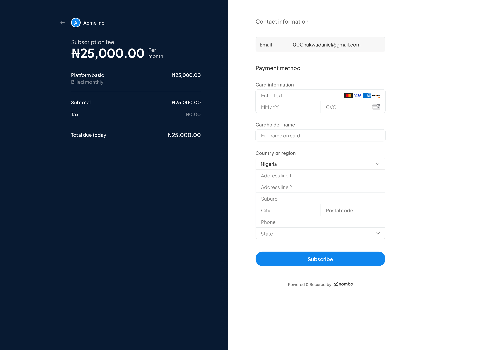
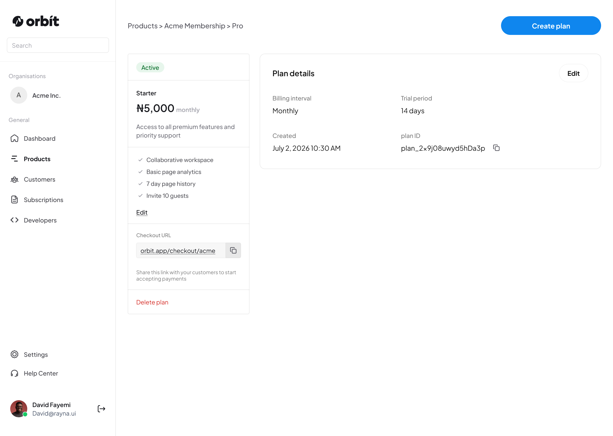
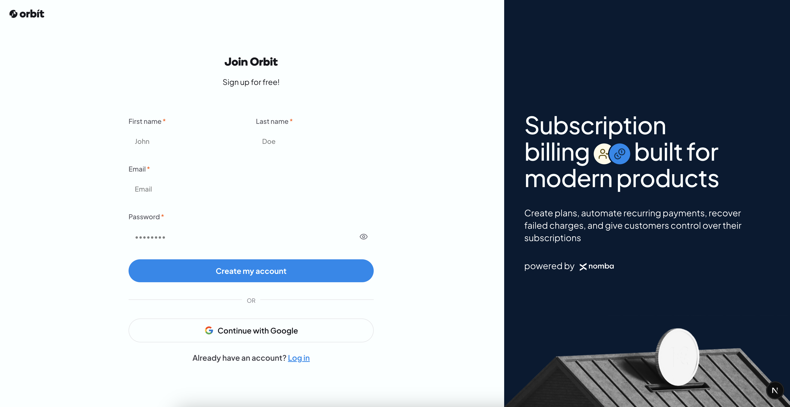
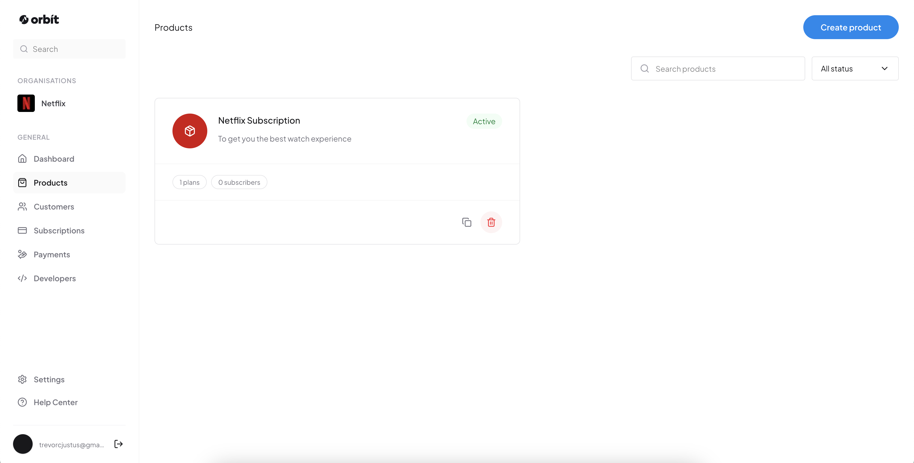

# Orbit

**Orbit** is a multi-tenant subscription billing and revenue infrastructure platform designed for modern software companies and digital merchants. It enables businesses to define products, configure pricing tiers, process recurring card payments, automate billing and dunning cycles, and manage settlements via Paystack.

---

## Live Links

- **Live Application:** [https://orbit-billing-nomba.vercel.app](https://orbit-billing-nomba.vercel.app)
- **Interactive API Documentation:** [https://orbit-billing-nomba.vercel.app/docs](https://orbit-billing-nomba.vercel.app/docs)






---

## Architectural Highlights

- **Multi-Tenant Isolation:** Complete logical tenant segregation enforced at the database level via `organisation_id` boundaries.
- **Paystack Recurring Engine:** Tokenizes customer payment methods during initial checkout and headlessly charges authorizations on renewal intervals.
- **Automated Settlement & Payouts:** Integrated with Paystack Transfers API, supporting automated scheduled payouts, real-time NUBAN resolution, and a transparent 5% platform fee structure.
- **Developer-First REST API:** Public REST API v1 (`/api/v1`) with dual identifier lookups (UUID or customer email), developer webhooks (`orbit-signature` HMAC verification), and drop-in pricing table components.
- **Self-Service Customer Portal:** Tokenized billing portal (`/portal/:token`) allowing end-users to view invoice history, update card payment methods, and manage subscription cancellations without merchant intervention.
- **Paystack Dark Theme:** Sleek, high-contrast dark mode interface powered by Tailwind CSS v4 and a zero-flash `ThemeProvider`.

---

## Core Features

### 1. Multi-Tenant Merchant Dashboard
Orbit isolates all business intelligence, customers, plans, and transaction histories by tenant:
- **Gross Volume & MRR:** Real-time recurring revenue metrics calculated across active subscriptions.
- **Interactive Revenue Charts:** Dynamic Recharts area visualizations plotting daily payment volume.
- **Organization Management:** Custom branding, logo uploads, and slug generation.

### 2. Products & Pricing Tiers
Create modular products with flexible billing cadences:
- **Billing Intervals:** Monthly, Yearly, Custom Intervals, and 1-Day Demo testing cycles.
- **Hosted Checkout Links:** Unique checkout pages generated automatically (`/checkout/:productSlug`).
- **Embeddable Pricing Tables:** Drop-in React components for developer applications.

### 3. Recurring Billing & Dunning Engine
- **Headless Tokenization:** Securely captures Paystack `authorization_code` tokens upon first checkout.
- **Automated Cron Renewal (`/api/cron/renew`):** Daily background scheduler identifying due subscriptions, executing charges, and calculating renewal milestones.
- **Smart Dunning Policy:** 3-attempt automated recovery cycle with customer email notifications before marking delinquent accounts `PAST_DUE`.

### 4. Payouts & Settlement Infrastructure
- **Real-Time NUBAN Lookup:** Verifies Nigerian bank accounts against Paystack's bank directories.
- **Transparent 5% Fee Architecture:** 95% net settlement automatically calculated and dispatched to merchant accounts.
- **Withdrawal Safeguards:** Built-in 7-day rate-limiting cooldowns and minimum withdrawal thresholds.
- **Payout Ledger:** Detailed audit log tracking gross amounts, platform cuts, net deposits, and Paystack transfer codes.

### 5. Developer API Platform (`/api/v1`)
Integrate Orbit subscription billing directly into external web and mobile applications:
- **Authentication:** `Authorization: Bearer <sk_live_...>` or `Bearer <pk_live_...>`
- **Dual Lookups:** Query customer records and active subscriptions by UUID or direct email.

#### API Endpoints Reference

| Method | Endpoint | Description |
| :--- | :--- | :--- |
| `GET` | `/api/v1` | Root index listing available API endpoints and version status. |
| `POST` | `/api/v1/checkout/sessions` | Create a hosted checkout session reference for custom apps. |
| `GET` | `/api/v1/plans` | List active pricing tiers for the authenticated organisation. |
| `GET` | `/api/v1/products/:id` | Retrieve a product and its associated pricing plans. |
| `GET` | `/api/v1/customers/:id_or_email` | Retrieve customer profile by UUID or email address. |
| `GET` | `/api/v1/customers/:id_or_email/subscription` | Fetch live subscription status for an end-user. |
| `GET` | `/api/v1/subscriptions/:id` | Fetch detailed subscription object. |
| `POST` | `/api/v1/subscriptions/:id/cancel` | Cancel a subscription (immediately or at period end). |

#### Developer Webhook Events
Dispatches signed event payloads to merchant URLs with `orbit-signature: t=<timestamp>,v1=<hmac_sha256>`:
- `payment.succeeded` / `payment.failed`
- `subscription.created` / `subscription.renewed` / `subscription.cancelled` / `subscription.updated`

---

## Tech Stack

| Layer | Technologies |
| :--- | :--- |
| **Frontend Framework** | Next.js (App Router), React 19, TypeScript |
| **Styling & Icons** | Tailwind CSS v4, Lucide Icons, Sonner |
| **Data Visualization** | Recharts Area Charts |
| **Backend & APIs** | Next.js Route Handlers, Server Actions |
| **Database & Auth** | Supabase PostgreSQL, Supabase Row-Level Security (RLS), Supabase Auth |
| **Payment Gateway** | Paystack Payment Gateway & Transfers API |
| **Email Delivery** | Resend API |
| **Deployment** | Vercel (Edge & Serverless Infrastructure) |

---

## Database Architecture

```
                       ┌──────────────────────┐
                       │    organisations     │
                       └──────────┬───────────┘
                                  │
         ┌────────────────────────┼────────────────────────┐
         │ 1:N                    │ 1:N                    │ 1:N
         ▼                        ▼                        ▼
┌─────────────────┐      ┌─────────────────┐      ┌─────────────────┐
│    products     │      │    customers    │      │     payouts     │
└────────┬────────┘      └────────┬────────┘      └─────────────────┘
         │ 1:N                    │ 1:N
         ▼                        ▼
┌─────────────────┐      ┌─────────────────┐
│      plans      │◄─────┤  subscriptions  │
└─────────────────┘ 1:N  └────────┬────────┘
                                  │ 1:N
                                  ▼
                         ┌─────────────────┐
                         │    payments     │
                         └─────────────────┘
```

---

## Environment Configuration

Create a `.env.local` file with the following environment variables:

```env
# App URL
NEXT_PUBLIC_APP_URL=https://orbit-billing-nomba.vercel.app

# Supabase Configuration
NEXT_PUBLIC_SUPABASE_URL=https://<your-project>.supabase.co
NEXT_PUBLIC_SUPABASE_ANON_KEY=eyJhbGciOi...
SUPABASE_SERVICE_ROLE_KEY=eyJhbGciOi...

# Paystack API Keys
PAYSTACK_SECRET_KEY=sk_test_...
NEXT_PUBLIC_PAYSTACK_PUBLIC_KEY=pk_test_...

# Email & Infrastructure
RESEND_API_KEY=re_...
CRON_SECRET=your_secure_cron_secret
```

---

## Getting Started

### 1. Clone the repository
```bash
git clone https://github.com/trevorcj/orbit.git
cd orbit
```

### 2. Install dependencies
```bash
npm install
```

### 3. Run Database Migrations
Execute the SQL migration scripts in `supabase/migrations/` in your **Supabase Dashboard &gt; SQL Editor**:
- `20260820_developer_api.sql`
- `20260820_payouts_schema.sql`

### 4. Start Local Development Server
```bash
npm run dev
```

Navigate to `http://localhost:3000` in your browser.

---

## License

This project is proprietary software developed by Trevor C. Justus. All rights reserved.
